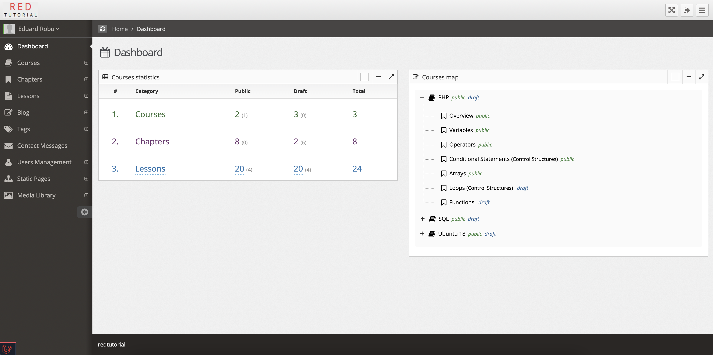
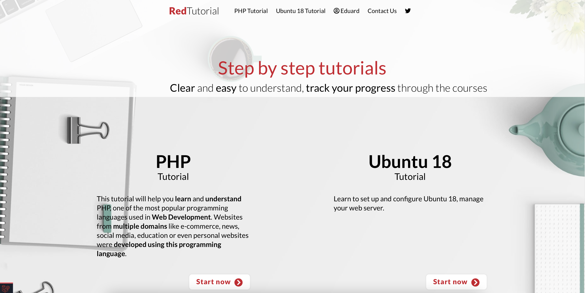
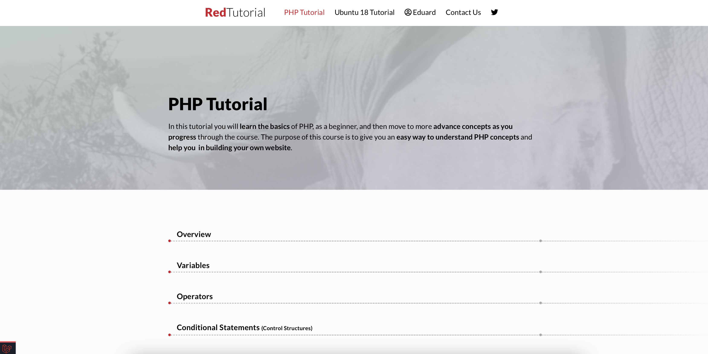
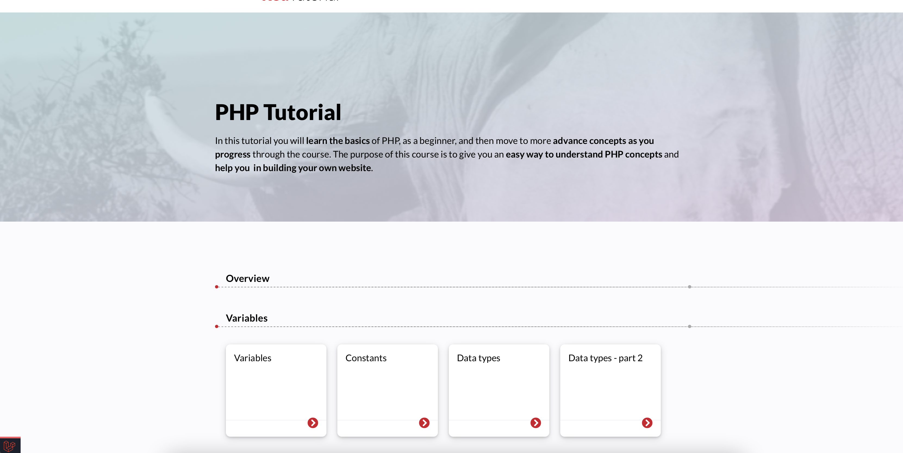

# Docker-Laravel

## Setting up

##### 0 Environments info
Set the ```DB_HOST``` from ```.env``` to the mysql service name (currently ```db```, so ```DB_HOST=db```).

##### 1 Start the services
Run the commands inside the root folder of your Laravel project

```
docker-compose build
docker-compose up -d
```

##### 2 Wait...
A temporary ```initial-script-progress.txt``` file will be created, wait until it's automatically deleted before using the services.

First time when booting up the services it will take longer.

## Client side usage
Go in the browser to [http://localhost:8001](http://localhost:8001) to view the app (currently the nginx service uses the 8001 port).

Go in the browser to [http://localhost:7001](http://localhost:7001) to check the database in phpmyadmin (currently the phpmyadmin service uses the 7001 port).

# App Screenshots






##### Enjoy by Eduard Robu!
